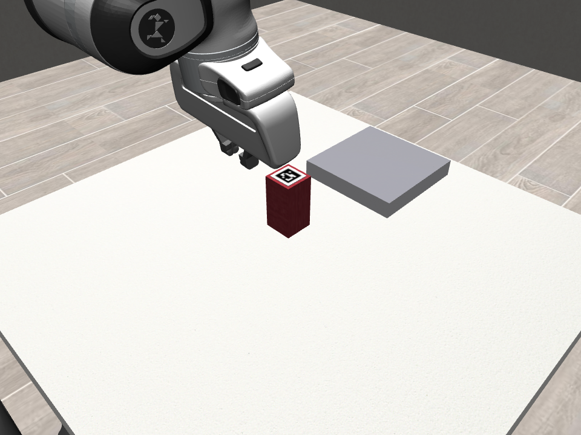
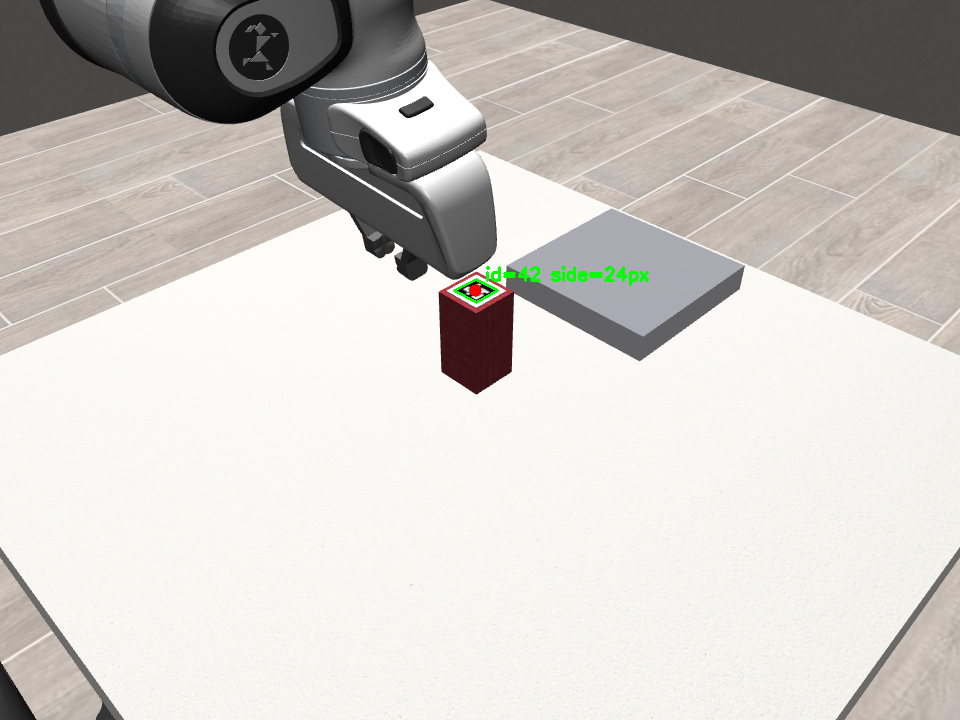
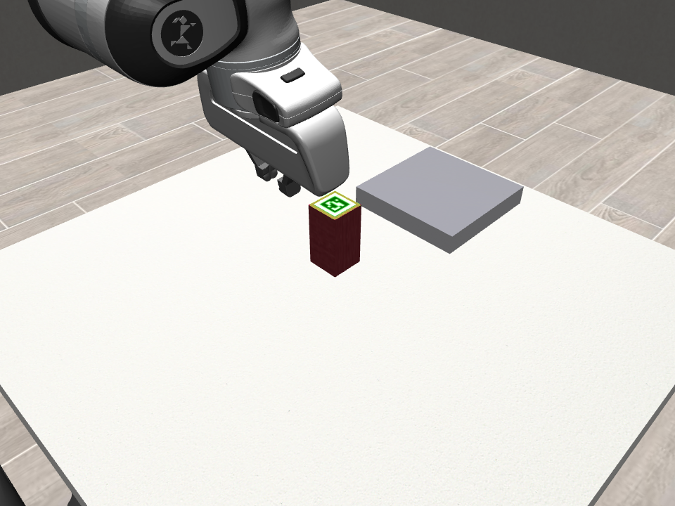
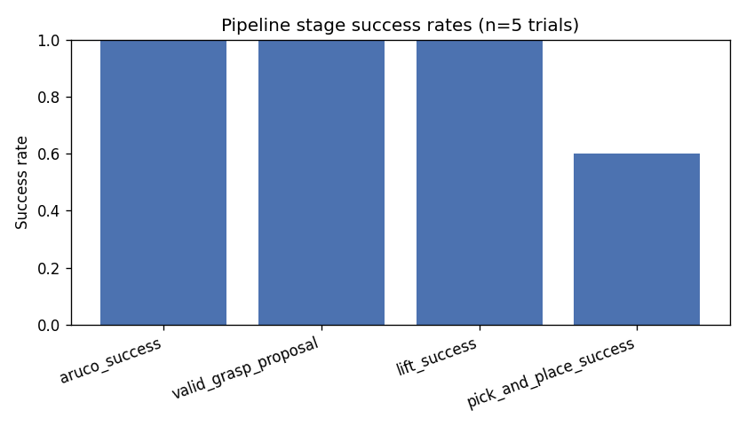
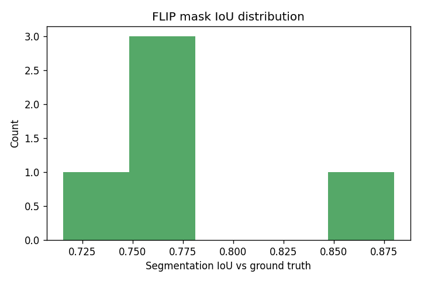

# physical-ai-pick-and-place

ArUco-Guided Point-Prompted Object Segmentation for Class-Agnostic Robotic Grasping in MuJoCo.

A Franka Panda arm, simulated in MuJoCo via robosuite, picks up a bottle-like round object and places it in a bin without ever being told what class of object it is. An ArUco marker stuck to the object's curved side gives a single point prompt; FLIP (a fovea-like, foundation-model-scale segmentation network) turns that point into a full object mask; the mask plus depth becomes a 3D point cloud; a class-agnostic geometric planner turns the point cloud into a grasp pose; a closed-loop operational-space controller executes the grasp. Ground truth from the simulator is used only to score results afterward, never to help the pipeline decide anything.

All 8 pipeline stages are implemented and verified end to end: real ArUco detection, real FLIP ONNX inference (with the actual `flip_position` C extension built and running, not stubbed), real point-cloud construction, real grasp planning, and real robosuite OSC execution that places the object in the destination bin.

## How it works

1. **Capture** — an oblique camera in the MuJoCo scene renders RGB-D.
2. **ArUco prompt** (`aruco_prompt.py`) — `cv2.aruco` detects the marker on the target object; its center pixel becomes the one point FLIP is given. This is the only information the pipeline has about "which object to grasp" — nothing here knows or uses the object's class or shape.
3. **FLIP segmentation** (`flip_segmenter.py`, wrapping `segment.py`) — the point prompt is fed to a FLIP-Tiny/Small ONNX model, which returns a binary mask of the object's full visible extent.
4. **Point cloud** (`geometry.py`) — the mask is combined with the depth map and camera intrinsics/extrinsics to produce a 3D point cloud of the object in the robot's base frame, with the table plane removed.
5. **Grasp planning** (`grasp_planner.py`) — a class-agnostic top-down planner fits the point cloud's footprint and orientation and proposes pre-grasp / grasp / lift / place poses. No shape priors, no object-specific training.
6. **Execution** (`robot_controller.py`) — robosuite's OSC_POSE controller drives the Panda through the plan, closing the gripper on contact rather than a purely geometric guess.
7. **Orchestration** (`pipeline.py`) — runs stages 1-6 end to end, logs each stage, and saves a video plus per-stage debug images.
8. **Evaluation** (`evaluation.py`) — the only module allowed to read simulator ground truth. It runs controlled trials and scores ArUco success rate, FLIP mask IoU against the true silhouette, grasp validity, lift success, and full pick-and-place success, purely as a post-hoc check.

See `THESIS_PLAN.md` for the full architectural rationale, module-by-module design notes, and the real bugs found and fixed while building this (MuJoCo texture-mapping quirks, a MuJoCo/robosuite version incompatibility, a quaternion double-cover control bug, an unreachable-wrist grasp yaw, and others).

## Results

**Point prompt to segmentation to a completed grasp**, from an actual run of `pipeline.py`:

| Capture | ArUco detection | FLIP segmentation |
|---|---|---|
|  |  |  |

**Full execution**, from the same run — the Panda picking up the object and placing it in the bin:

`runs/example_run/03_execution.mp4`

**Evaluation across trials** (`evaluation.py`, ground-truth-scored):

| Stage success rates | FLIP mask IoU vs. ground truth |
|---|---|
|  |  |

Raw per-trial numbers are in `eval_results/metrics.csv`. Across a 5-trial sweep: ArUco detection, grasp proposal, and lift all succeeded 100% of the time; full pick-and-place succeeded 3/5 (the one clean failure had an unusually small visible point cloud from that viewing angle, producing an inaccurate grasp width — see Known limitations); mean FLIP mask IoU against ground truth was 0.77.

## Installation

```
python -m venv .venv
.venv\Scripts\activate        (Windows)
pip install -r requirements.txt
```

`requirements.txt` pins `mujoco==3.3.0` deliberately — newer MuJoCo python bindings removed the `MjData.qM` attribute that robosuite 1.5.2's OSC_POSE controller depends on. Letting `mujoco` float to a newer version breaks the controller with `AttributeError: 'MjData' object has no attribute 'qM'`. This was reproduced directly, not assumed from a changelog.

### FLIP weights and the `flip_position` C extension

`flip_segmenter.py` wraps `segment.py::FlipSegmenter`, which needs two things that are not pip-installable:

1. **The FLIP ONNX weights** (`flip-encoder-<size>.onnx`, `flip-predictor-<size>.onnx`), downloaded from the FLIP repo (see Credits below). Point the `FLIP_WEIGHTS_DIR` environment variable at the folder containing them.
2. **The `flip_position` C extension**, which samples FLIP's multi-resolution input patches — there is no pure-Python fallback. Build it once from FLIP's own source:
   ```
   cd <path-to-FLIP>/ext
   python setup.py build_ext --inplace
   ```
   Then make sure the built `flip_position*.so` / `.pyd` is importable — run scripts from that directory, add it to `PYTHONPATH`, or copy it into your venv's `site-packages`. It builds cleanly with plain GCC on Linux.

### Rendering backend

MuJoCo needs a working OpenGL context for offscreen rendering — normally automatic on Windows. On headless Linux, if you hit `AttributeError: 'NoneType' object has no attribute 'eglQueryString'`, EGL/OSMesa aren't available; use `MUJOCO_GL=glx` under `Xvfb` instead.

## Running each phase

All commands run from the repo root, inside the virtual environment.

```
python environment.py       # Phase 1: scene + camera sanity check
python aruco_prompt.py      # Phase 2: ArUco detection on a live render
python flip_segmenter.py    # Phase 3: real FLIP segmentation from the ArUco prompt
python geometry.py          # Phase 4: masked depth -> robot-frame point cloud
python grasp_planner.py     # Phase 5: grasp pose planning (prints the plan)
python robot_controller.py  # Phase 6: executes one grasp plan on the Panda
python pipeline.py          # Phase 7: full closed loop -> runs/<timestamp>/
python evaluation.py N      # Phase 8: N controlled trials -> eval_results/
```

Each module is independently runnable; every self-test re-derives what it needs by calling the earlier modules directly rather than requiring them to be run first as separate processes.

`python pipeline.py` prints one `[STAGE:OK]`/`[STAGE:FAIL]` line per stage, then a JSON summary with `"success": true/false`. A successful run's `runs/<timestamp>/` directory contains the same set of images and video shown above, plus `log.json` with the full stage-by-stage log.

## Known limitations

- **Single camera means partial 2.5D geometry.** The point cloud only contains what one camera sees in one frame — mostly the object's marker-facing curved side, not its full circumference. On viewing angles where that visible slice is unusually small, the estimated grasp width can be inaccurate (the one failure in the 5-trial sweep above: a valid but too-narrow grasp that then missed the bin on placement). Grasp height is likewise an estimate refined by close-until-contact / stop-on-stall behavior during execution, not a measurement of the object's hidden geometry.
- **Fixed target rotation.** The ArUco decal is a flat patch tangent to the object's curved side, angled to face the camera — it only renders and detects correctly at the fixed yaw the object is placed at (`randomize_object_rotation=False`). A MuJoCo texture-mapping limitation (2D textures on primitive geoms only resolve correctly on the face normal to that geom's own local Z axis), documented at its fix site in `environment.py`.
- **ArUco detection is placement-sensitive.** The marker can still go undetected in some trials purely from placement variation within the current sampling range, since a large XY offset shifts how much of the curved decal remains visible/undistorted from the fixed camera angle.

## Troubleshooting

- **Rendered image looks upside down**: `robosuite.macros.IMAGE_CONVENTION` must be set to `"opencv"` before the environment is constructed — see the top of `environment.py`.
- **`AttributeError: 'MjData' object has no attribute 'qM'`**: wrong MuJoCo version; this pipeline needs `mujoco==3.3.0`. See `requirements.txt`.
- **ArUco marker renders as a flat gray square with no visible pattern**: either the marker PNG was saved as grayscale (MuJoCo's texture loader silently fails on grayscale-only PNGs), or the decal geom's `quat` doesn't point its own local Z axis at the viewer (this MuJoCo build's `type="2d"` texture mapping only resolves correctly on the face normal to a geom's own local Z axis — true for any orientation, not just "top" vs "side"). Both are explained and fixed in `environment.py`.
- **ArUco marker renders but looks like a skewed, dark parallelogram and fails to detect**: the decal's outward-facing azimuth doesn't actually point at the camera. `environment.py` computes this azimuth directly from the camera's real XY offset (`_CAMERA_XY_OFFSET`) rather than a hardcoded direction — if the camera position ever changes, the decal azimuth must be recomputed from it, not left pointing the old way.
- **A robot motion stage stalls with a large, non-shrinking position error**: if it's a descend stage (grasp approach or release), this is often expected — real contact stopping the motion early, handled by `stop_on_stall` in `robot_controller.py`. If a large lateral move stalls far from its target, check the planned grasp yaw; `grasp_planner.py` normalizes yaw into `(-90, 90]` degrees specifically because values near 180 degrees drove the Panda into an unreachable wrist configuration during verification.

## Credits

This project builds directly on the following work:

- **FLIP** — Manuel Traub and Martin V. Butz, "Looking Locally: Object-Centric Vision Transformers as Foundation Models for Efficient Segmentation," arXiv:2502.02763, 2025. [Paper](https://arxiv.org/pdf/2502.02763) · [Code](https://github.com/CognitiveModeling/FLIP) · [Project page](https://cognitivemodeling.github.io/FLIP). FLIP-Tiny/Small provide the point-prompted segmentation this pipeline depends on. `segment.py`'s ArUco-to-FLIP wrapper originates from the author's own earlier prototype, [aruco-flip-segmentation](https://github.com/Vardhan1303/aruco-flip-segmentation).

  ```bibtex
  @article{traub2025flip,
    title={Looking Locally: Object-Centric Vision Transformers as Foundation Models for Efficient Segmentation},
    author={Traub, Manuel and Butz, Martin V},
    journal={arXiv preprint arXiv:2502.02763},
    year={2025}
  }
  ```

- **MuJoCo** — the physics engine this entire simulation runs on, originally developed by Emo Todorov and now maintained by Google DeepMind. [google-deepmind/mujoco](https://github.com/google-deepmind/mujoco).

- **robosuite** — the simulation framework providing the manipulation environment, Panda robot model, OSC_POSE controller, and camera utilities this project builds its `PickPlaceEnv` on, from the ARISE Initiative at Stanford / UT Austin / UC Berkeley. [ARISE-Initiative/robosuite](https://github.com/ARISE-Initiative/robosuite).

- **OpenCV / ArUco** — `cv2.aruco` provides the marker detection that grounds the entire point-prompt pipeline. [opencv/opencv](https://github.com/opencv/opencv).

## License

MIT — see `LICENSE`. Third-party components (FLIP, MuJoCo, robosuite, OpenCV) retain their own licenses; see their respective repositories.
