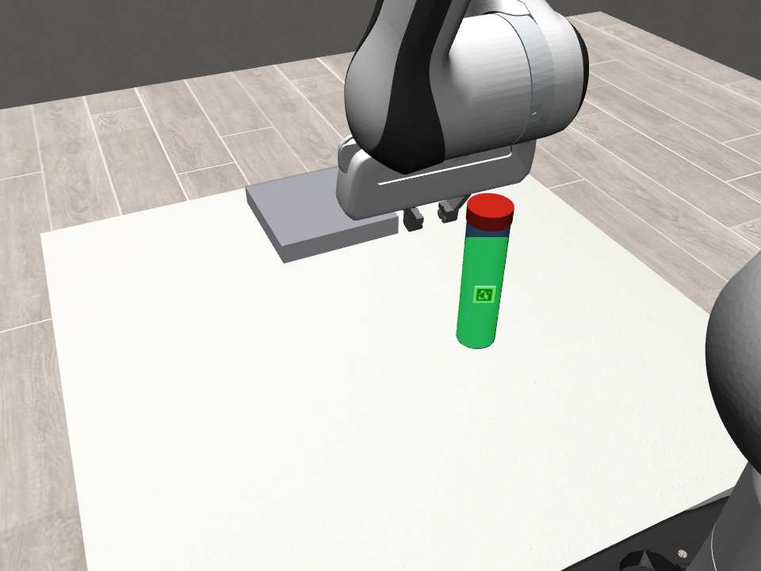
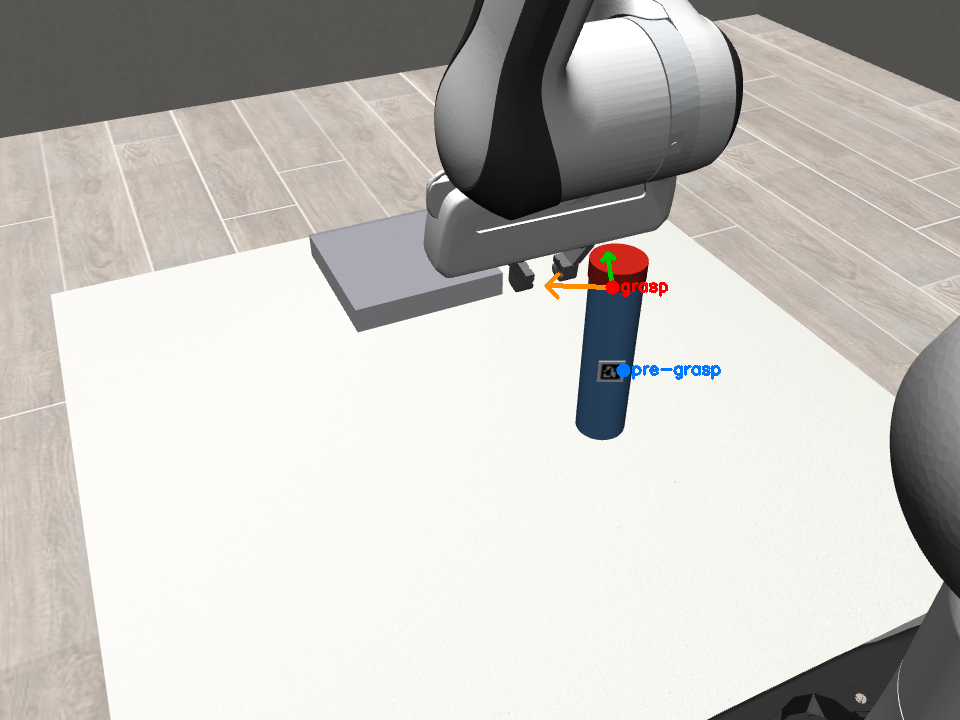
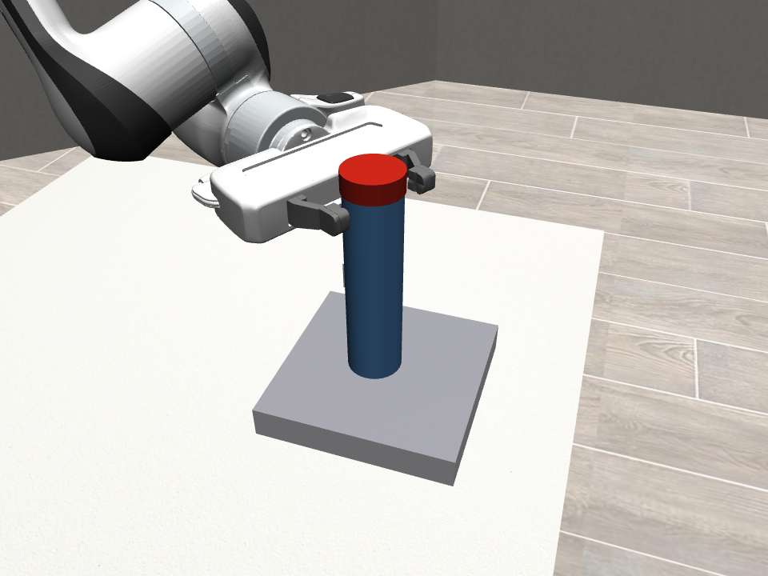
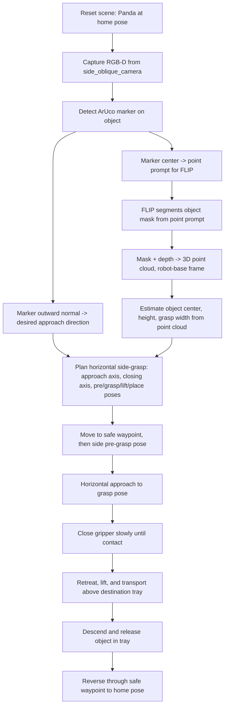
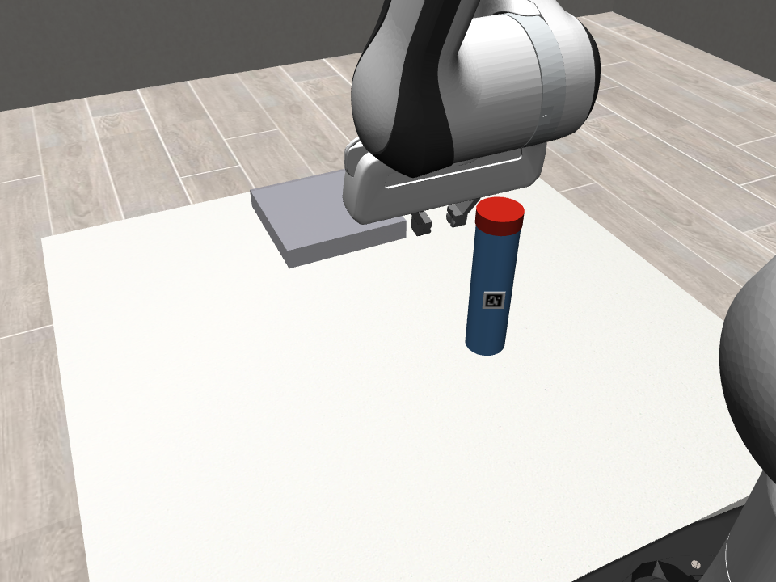
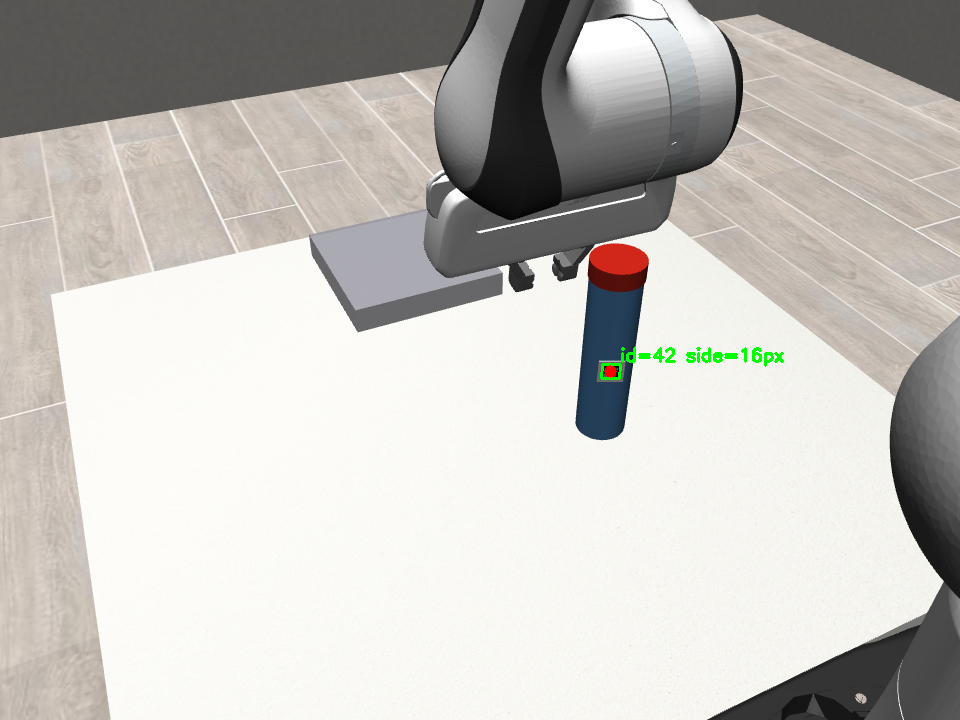
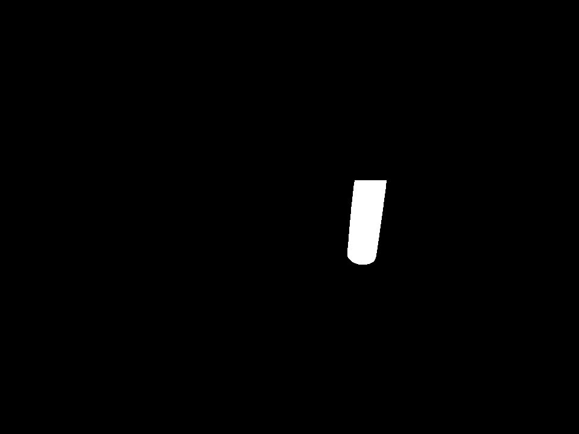
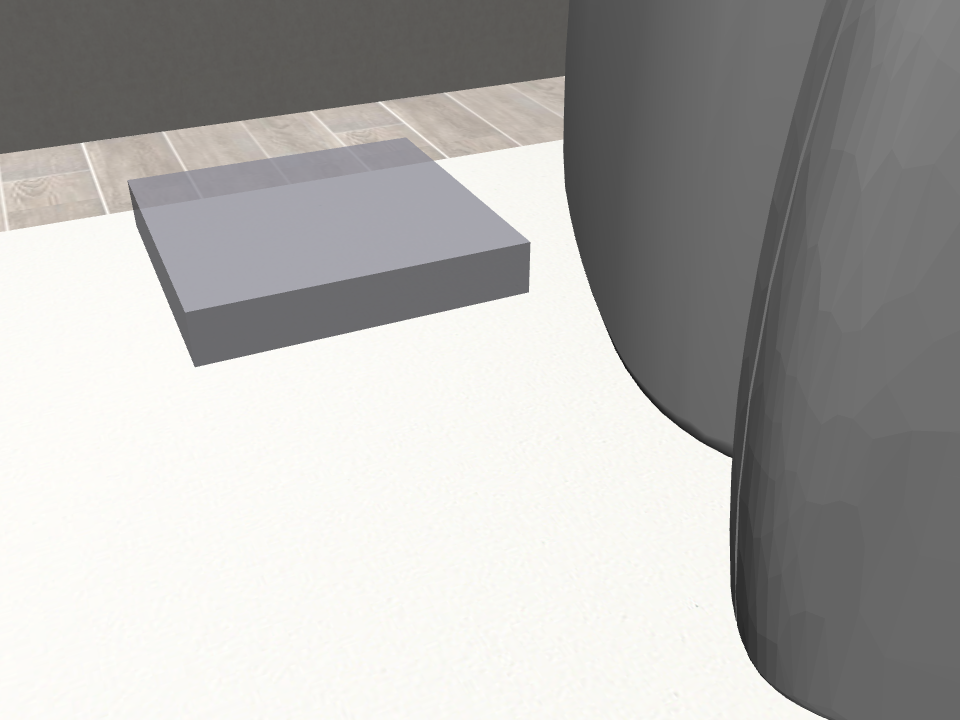

# Physical AI: ArUco-Guided FLIP Segmentation for Pick-and-Place

**A prompt-guided, class-agnostic pick-and-place pipeline in simulation: detect an ArUco marker, use its center and surface normal as a segmentation and approach prompt, segment the object with FLIP, and execute a true horizontal side-grasp with a Franka Panda arm in MuJoCo.**

[](LICENSE)
[](https://arxiv.org/pdf/2502.02763)
[](https://github.com/CognitiveModeling/FLIP)
[](https://github.com/ARISE-Initiative/robosuite)
[](https://github.com/google-deepmind/mujoco)

<p align="center">
  
  
  
</p>

---

## 1. Project Overview

This repository is an initial simulation prototype demonstrating a complete **perception-to-pick-and-place loop** in which a robot arm picks up an object it has never been explicitly trained to recognize. Instead of a category-specific detector, the object carries a small ArUco fiducial marker on its side. The marker's center pixel is used as a single **point prompt** for [FLIP](https://github.com/CognitiveModeling/FLIP), a foundation-model-scale, object-centric segmentation network, which turns that one point into a full segmentation mask of the object — without ever being told what class of object it is.

The masked depth is then converted into a 3D point cloud, a class-agnostic geometric planner turns that point cloud into a true **horizontal side-grasp** pose, and a closed-loop operational-space controller drives a simulated Franka Panda arm through the full sequence: approach, grasp, lift, transport, and place into a destination tray.

The scene currently contains one object — an upright cylinder with the marker on its curved side — run through a single, deterministic rollout. This demo validates that the full loop (marker detection → prompt → segmentation → 3D geometry → grasp planning → closed-loop execution) works end to end, not that any one component alone is a finished, general-purpose system.

## 2. Real-World Problem

General-purpose object detectors and segmentation models are trained on large, fixed-category datasets. That works well for object shapes they've seen many examples of, but they can fail or misclassify when an object falls outside that training distribution — a closed-set detector doesn't know it's looking at a graspable object if that object doesn't resemble anything in its training data.

A robot operating in an unstructured or changing environment can't always rely on a category-specific model having been trained on every object it might need to pick up. A physical fiducial marker sidesteps that problem: it gives the perception system an unambiguous point of reference on the object, which a lightweight promptable segmentation model (FLIP) can turn into a full mask regardless of the object's shape or category, and which also encodes the object's local surface orientation — useful for deciding which direction to approach it from.

## 3. Simulation Prototype Approach

This prototype is deliberately scoped to prove the mechanism, not to benchmark it:

- **One marker selects the target and its approach direction.** The ArUco marker's center pixel is the segmentation prompt; the marker's *plane normal* (from `solvePnP`) is the desired horizontal approach direction. The marker center is a surface point and a prompt — it is not assumed to be the object's true center.
- **FLIP does the actual segmentation.** The marker only tells the pipeline *where to look*; FLIP-Small determines the object's full visible extent from that single point, independent of object class.
- **Grasp geometry comes from the point cloud, not the simulator.** Object center, visible height, and grasp width are all estimated from the FLIP-masked depth point cloud — the same information a real depth camera would provide. Simulator ground truth is never read by the perception or planning code; it is only ever used in this project's own debug scripts to *diagnose* a run, never to influence the pipeline's decisions.
- **One scene, one object, one deterministic rollout.** The cylinder-and-tray scene, camera layout, and motion sequence are fixed. Multi-object scenes, shape/category benchmarking, and randomized trials are intentionally out of scope for this stage — see [Current Scope and Limitations](#11-current-scope-and-limitations).

## 4. End-to-End Pipeline Flowchart



## 5. System Architecture

| Module | Responsibility |
|---|---|
| `environment.py` | Builds the MuJoCo/robosuite scene: table, tray, the ArUco-marked cylinder, the Panda arm, and four cameras. |
| `aruco_prompt.py` | `cv2.aruco` marker detection + `solvePnP`-based marker pose (center, outward normal) from a single RGB frame. |
| `flip_segmenter.py` | Wraps the real FLIP ONNX encoder/predictor (`segment.py`) with ROI cropping around the marker prompt and minimal post-mask cleanup. |
| `geometry.py` | Masked depth → 3D point cloud, camera → world → robot-base frame, with RANSAC-based tabletop-plane removal. |
| `grasp_planner.py` | Class-agnostic horizontal side-grasp planning: builds the approach/closing/up axes and the full pre-grasp → grasp → lift → place pose sequence from the point cloud alone. |
| `robot_controller.py` | Closed-loop execution of the plan via robosuite's real OSC_POSE controller — proportional position/orientation control, close-until-contact gripping, stall detection for contact-terminated moves. |
| `demo_config.py` | The single configuration surface for every tunable motion/grasp parameter (see [Configurable Parameters](#10-configurable-parameters)). |
| `final_demo.py` | Orchestrates one full deterministic rollout: perception → planning → execution, saving all stills, videos, and a structured `log.json`. |
| `pipeline.py` | Shared `VideoRecorder` utility — H.264 (Baseline profile) encoding for broad player compatibility. |

**Camera policy.** Only `side_oblique_camera` feeds the perception pipeline (ArUco detection, FLIP segmentation, point-cloud construction, grasp planning). Three additional cameras — `overview_camera`, `side_grasp_closeup_camera`, `place_closeup_camera` — are render-only and exist purely to produce presentation video; none of their output is ever used by the perception or planning code.

## 6. Demo Sequence

The scene: one upright cylinder with a visible ArUco marker on its side, one destination tray, and a Panda arm starting from a fixed, reproducible home pose. A single rollout executes:

**reset → home pose → capture → detect marker → segment object → build point cloud → plan side-grasp → safe waypoint → side pre-grasp → horizontal approach → close gripper → retreat → lift → transport → descend → release → retract → return home**

All four presentation videos and all seven still images below come from this *same* rollout (identical seed, object pose, and robot trajectory) — the cameras are captured simultaneously during one execution, not stitched from separate replay passes.

## 7. Images and Video Links

### Perception stages

| Captured RGB | ArUco detection + prompt | FLIP mask | FLIP overlay |
|---|---|---|---|
|  |  |  |  |

### Grasp planning and execution

| Planned grasp | Pick | Place |
|---|---|---|
|  |  |  |

`04_grasp_plan.png` shows the estimated object center, the approach axis (green), and the finger-closing axis (orange), projected back into the camera frame from the robot-base-frame grasp plan.

### Videos (same rollout, four synchronized cameras)

| Video | Camera | Description |
|---|---|---|
| [`01_overview.mp4`](demo_output/videos/01_overview.mp4) | `overview_camera` | Wide shot of the full scene — Panda, cylinder, and tray. |
| [`02_perception_camera.mp4`](demo_output/videos/02_perception_camera.mp4) | `side_oblique_camera` | The actual perception camera, with ArUco corners/ID/center, the FLIP mask contour, and the planned grasp axes burned in live. |
| [`03_side_grasp_closeup.mp4`](demo_output/videos/03_side_grasp_closeup.mp4) | `side_grasp_closeup_camera` | Close side view of the horizontal approach and grasp. |
| [`04_place_closeup.mp4`](demo_output/videos/04_place_closeup.mp4) | `place_closeup_camera` | Close view of the destination tray during release. |

## 8. Installation

```bash
python -m venv .venv
.venv\Scripts\activate        # Windows
pip install -r requirements.txt
```

`requirements.txt` deliberately pins `mujoco==3.3.0`. Newer MuJoCo Python bindings removed the `MjData.qM` attribute that robosuite 1.5.2's OSC_POSE controller depends on internally — letting `mujoco` float to a newer version breaks the controller with `AttributeError: 'MjData' object has no attribute 'qM'`.

### FLIP weights and the `flip_position` C extension

`flip_segmenter.py` wraps `segment.py::FlipSegmenter`, which needs two things that are not pip-installable:

1. **The FLIP ONNX weights** (`flip-encoder-<size>.onnx`, `flip-predictor-<size>.onnx`) — download from the [original FLIP repo](https://github.com/CognitiveModeling/FLIP). Point the `FLIP_WEIGHTS_DIR` environment variable at the folder containing them (defaults to a sibling `FLIP-main/model/weights` folder — see the top of `flip_segmenter.py`).
2. **The `flip_position` C extension**, which samples FLIP's multi-resolution input patches — there is no pure-Python fallback. Build it once from FLIP's own source:
   ```bash
   cd <path-to-FLIP>/ext
   python setup.py build_ext --inplace
   ```
   Then make sure the built `flip_position*.so`/`.pyd` is importable (run from that directory, add it to `PYTHONPATH`, or copy it into your environment's `site-packages`).

### Rendering backend

MuJoCo needs a working OpenGL context for offscreen rendering — normally automatic on Windows. On headless Linux, if you hit `AttributeError: 'NoneType' object has no attribute 'eglQueryString'`, EGL/OSMesa aren't available; run under `Xvfb` with `MUJOCO_GL=glx` instead.

## 9. How to Run the Demo

```bash
# Full run: perception, planning, execution, all 7 stills + 4 videos
python final_demo.py

# Faster iteration: images only, skip video encoding
python final_demo.py --no-video

# Reproduce this exact rollout
python final_demo.py --seed 0 --out-dir demo_output
```

Every run prints one line per pipeline stage — marker ID and center, FLIP inference time and mask area, point-cloud size, estimated object center/width, the full planned pose sequence, and per-motion-stage convergence — then writes the same information to `demo_output/log.json`. A run's images land in `demo_output/images/`, its videos in `demo_output/videos/`.

## 10. Configurable Parameters

Every tunable used by the grasp and motion planner lives in one place, `demo_config.py::DemoConfig`:

| Parameter | Default | Meaning |
|---|---|---|
| `gripper_open_margin` | `0.015` m | Added on top of the FLIP/depth-estimated object width when sizing the gripper opening. |
| `pregrasp_standoff` | `0.12` m | Distance outside the object, along the approach axis, for the pre-grasp waypoint. |
| `side_approach_speed` | `1.0` | Speed scale (0–1) for reconfiguration moves (safe waypoint ↔ pre-grasp, retreat, lift, transport). |
| `final_approach_speed` | `0.4` | Speed scale for the final horizontal approach into contact and the place-descend — deliberately slower and gentler. |
| `grasp_height_ratio` | `0.7` | Where up the visible object's vertical extent to grasp (0 = bottom of visible cloud, 1 = top); biased high for wrist clearance above the table. |
| `lift_height` | `0.08` m | Vertical lift after the grasp closes. |
| `place_height` | `None` | World-frame release height; `None` derives it from the tray's own top surface. |
| `safe_waypoint_height` | `0.20` m | Height above the table used for the safe/transit poses. |
| `controller_position_tolerance` | `0.008` m | Position convergence tolerance for the closed-loop controller. |
| `controller_orientation_tolerance` | `0.08` rad | Orientation convergence tolerance for the closed-loop controller. |

Additional supporting fields: `min_gripper_opening` / `max_gripper_opening` (physical gripper limits), `model_size` (FLIP Tiny/Small), and `seed` (deterministic scene/episode seed).

## 11. Current Scope and Limitations

- **Single object, single camera.** The perception pipeline uses one oblique camera and one object per rollout — genuinely 2.5D geometry (only the marker-facing side of the object is ever seen), not a full 3D reconstruction.
- **Estimated, not measured, grasp geometry.** Object height and grasp width come from a partial point cloud, refined at execution time by closing the gripper until contact rather than trusting the estimate alone.
- **No multi-object scenes, shape benchmarking, or randomized trials at this stage.** The scene, object, and trajectory are fixed and deterministic, by design — this demo is scoped to prove the full loop works, not to characterize success rate across conditions.
- **No comparison against a category-specific detector in this repository.** (A separate, earlier prototype — [aruco-flip-segmentation](https://github.com/Vardhan1303/aruco-flip-segmentation) — compares this same marker + FLIP approach against a COCO-pretrained YOLO baseline on static photos; that comparison is not part of this simulation pipeline.)
- **Fixed object orientation.** The ArUco decal is a flat patch tangent to the cylinder's curved side; it renders and detects reliably at the object's current placement, not under arbitrary rotation.

## 12. Next Steps

Natural extensions beyond this initial prototype, in roughly increasing order of scope:

- Multiple simultaneous objects and sequential picking.
- Randomized object pose/placement trials with aggregate success-rate reporting.
- Additional object shapes to stress-test FLIP's class-agnostic segmentation beyond a single cylinder.
- Quantitative evaluation (mask IoU, grasp success rate) against simulator ground truth, used strictly as a post-hoc scoring tool.
- Reducing reliance on the fiducial marker — e.g., predicting an initial prompt point directly from image context.
- Transfer from this simulated pipeline toward a real depth camera and arm.

## Acknowledgments & Citation

This project depends on **FLIP (Fovea-Like Input Patching)**, developed by Manuel Traub and Prof. Martin V. Butz's group (Cognitive Modeling, University of Tübingen). No FLIP model code or weights are modified or redistributed here — only called via their published ONNX weights and C extension, per the original repo's instructions.

- Paper: [Looking Locally: Object-Centric Vision Transformers as Foundation Models for Efficient Segmentation](https://arxiv.org/pdf/2502.02763)
- Repo: [github.com/CognitiveModeling/FLIP](https://github.com/CognitiveModeling/FLIP)
- Project page: [cognitivemodeling.github.io/FLIP](https://cognitivemodeling.github.io/FLIP)

```bibtex
@article{traub2025flip,
  title={Looking Locally: Object-Centric Vision Transformers as Foundation Models for Efficient Segmentation},
  author={Traub, Manuel and Butz, Martin V},
  journal={arXiv preprint arXiv:2502.02763},
  year={2025}
}
```

Also builds directly on:

- **MuJoCo** — the physics engine this simulation runs on, developed by Emo Todorov and maintained by Google DeepMind. [google-deepmind/mujoco](https://github.com/google-deepmind/mujoco).
- **robosuite** — the simulation framework providing the manipulation environment, Panda robot model, OSC_POSE controller, and camera utilities. [ARISE-Initiative/robosuite](https://github.com/ARISE-Initiative/robosuite).
- **OpenCV / ArUco** — `cv2.aruco` provides the marker detection that grounds the entire point-prompt pipeline. [opencv/opencv](https://github.com/opencv/opencv).

## License

MIT — see `LICENSE`. Third-party components (FLIP, MuJoCo, robosuite, OpenCV) retain their own licenses; see their respective repositories.
